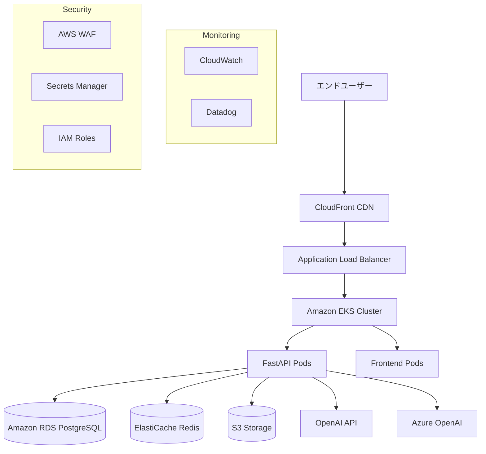
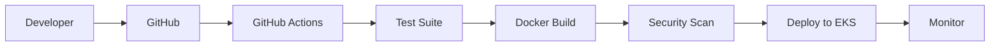

# 🏗️ Secure AI Chat - クラウドインフラ構築プラン

## 📋 インフラ要件と推奨プラットフォーム

### 🎯 要件定義
- **可用性**: 99.9% アップタイム（月間43分の停止時間）
- **スケーラビリティ**: 1,000+ テナント、10,000+ ユーザー対応
- **セキュリティ**: SOC 2 Type II、ISO 27001、GDPR準拠
- **パフォーマンス**: API応答時間 < 500ms、AIレスポンス < 3秒
- **コスト**: 月額運用コスト < ¥500,000（初期100テナント時）

### 🏆 推奨プラットフォーム比較

#### 1. AWS（Amazon Web Services） - **推奨** ⭐
**メリット:**
- 🏢 エンタープライズ実績豊富
- 🔐 最高レベルのセキュリティ・コンプライアンス
- 🤖 AI/MLサービス充実（Bedrock、SageMaker）
- 🌏 日本リージョン複数（東京、大阪）
- 📊 詳細な監視・ログ（CloudWatch、X-Ray）
- 💰 従量課金で初期コスト抑制

**推奨構成:**
```
Production: ap-northeast-1 (東京)
Staging: ap-northeast-3 (大阪)
DR: ap-southeast-1 (シンガポール)
```

#### 2. Google Cloud Platform (GCP)
**メリット:**
- 🤖 AI/ML機能が最先端
- ⚡ Kubernetesネイティブ
- 💨 高パフォーマンス
- 💰 シンプルな料金体系

**デメリット:**
- 🏢 エンタープライズ実績がAWSより少ない
- 📈 料金予測困難

#### 3. Microsoft Azure
**メリット:**
- 🏢 エンタープライズ環境との親和性
- 🤖 Azure OpenAI直接統合
- 🔐 Active Directory統合

**デメリット:**
- 🇯🇵 日本での実績・サポートがAWSより限定的
- 💰 コスト最適化が複雑

---

## 🎯 **推奨: AWS中心のマルチクラウド構成**

### 🏗️ インフラアーキテクチャ



### 💰 コスト見積もり（月間、100テナント想定）

| サービス | 用途 | 月額コスト |
|---------|------|----------|
| **Compute** |
| EKS Cluster | Kubernetesマスター | ¥10,000 |
| EC2 Instances (t3.large × 3) | ワーカーノード | ¥25,000 |
| **Storage** |
| RDS (db.t3.medium) | PostgreSQL | ¥15,000 |
| ElastiCache (cache.t3.micro) | Redis | ¥5,000 |
| S3 | ファイル・ログ保存 | ¥3,000 |
| **Networking** |
| Application Load Balancer | ロードバランサー | ¥3,000 |
| CloudFront | CDN | ¥2,000 |
| Route 53 | DNS | ¥1,000 |
| **Security** |
| AWS WAF | Webファイアウォール | ¥5,000 |
| Certificate Manager | SSL証明書 | 無料 |
| **Monitoring** |
| CloudWatch | 監視・ログ | ¥8,000 |
| Datadog Pro | APM・監視 | ¥12,000 |
| **Backup/DR** |
| RDS Backup | 自動バックアップ | ¥2,000 |
| S3 Cross Region | 災害復旧 | ¥1,000 |
| **合計** | | **¥92,000/月** |

### 📈 スケーリング計画

| テナント数 | ユーザー数 | インスタンス構成 | 月額コスト |
|-----------|-----------|----------------|----------|
| 100 | 1,000 | t3.large × 3 | ¥92,000 |
| 500 | 5,000 | t3.xlarge × 5 | ¥180,000 |
| 1,000 | 10,000 | t3.2xlarge × 8 | ¥350,000 |
| 2,000+ | 20,000+ | Auto Scaling | ¥500,000+ |

---

## 🐳 コンテナ・オーケストレーション戦略

### Docker化方針
- **Multi-stage Build**: イメージサイズ最適化
- **Security Scanning**: Trivy/Synkでの脆弱性チェック
- **Non-root User**: セキュリティ強化
- **Health Checks**: ヘルスチェックエンドポイント組み込み

### Kubernetes構成
```yaml
# Production環境の推奨構成
apiVersion: v1
kind: Namespace
metadata:
  name: secure-ai-chat-prod

---
# Backend API
apiVersion: apps/v1
kind: Deployment
metadata:
  name: api
spec:
  replicas: 3
  template:
    spec:
      containers:
      - name: api
        image: secure-ai-chat/api:latest
        resources:
          requests:
            cpu: 200m
            memory: 512Mi
          limits:
            cpu: 500m
            memory: 1Gi
        env:
        - name: DATABASE_URL
          valueFrom:
            secretKeyRef:
              name: app-secrets
              key: database-url
```

---

## 🔐 セキュリティ・コンプライアンス設計

### セキュリティレイヤー
1. **ネットワークセキュリティ**
   - VPC分離（Public/Private Subnet）
   - Security Group最小権限
   - NACLs追加制御
   - AWS WAF DDoS防御

2. **アプリケーションセキュリティ**
   - JWT トークン認証
   - API Rate Limiting
   - 入力値検証・サニタイズ
   - HTTPS強制・HSTS

3. **データセキュリティ**
   - 保存時暗号化（RDS、S3）
   - 転送時暗号化（TLS 1.3）
   - 機密データ（Secrets Manager）
   - 定期的な脆弱性スキャン

### コンプライアンス対応
- **SOC 2 Type II**: AWS Artifact経由で証明書取得
- **GDPR**: データ保護・削除権対応
- **ISO 27001**: セキュリティマネジメント体制
- **PCI DSS**: Stripe Connectで準拠

---

## 📊 監視・ログ・アラート戦略

### 監視スタック
```yaml
# 推奨監視ツール構成
Metrics: Datadog + CloudWatch
Logs: ELK Stack (AWS Elasticsearch)
APM: Datadog APM
Uptime: Datadog Synthetics
Error Tracking: Sentry
```

### アラート設定
| メトリクス | 閾値 | アクション |
|------------|------|-----------|
| API Response Time | > 1秒 | Warning → Slack |
| Error Rate | > 5% | Critical → PagerDuty |
| CPU Usage | > 80% | Auto Scaling |
| Memory Usage | > 85% | Auto Scaling |
| Disk Space | > 90% | Critical Alert |
| Failed Logins | > 10/min | Security Alert |

---

## 🚀 CI/CD パイプライン設計

### GitOps フロー


### デプロイ戦略
- **Blue-Green Deployment**: ゼロダウンタイム
- **Canary Release**: 段階的ロールアウト
- **Feature Flags**: 機能の段階的リリース
- **Rollback**: 迅速な巻き戻し機能

---

## 💾 バックアップ・災害復旧

### バックアップ戦略
- **RDS**: 自動バックアップ（35日保持）+ 手動スナップショット
- **S3**: Cross-Region Replication
- **EKS**: etcd定期バックアップ
- **アプリケーション**: コードはGitで管理

### DR（災害復旧）計画
- **RTO（復旧時間目標）**: 4時間
- **RPO（復旧ポイント目標）**: 1時間
- **Multi-AZ構成**: 自動フェイルオーバー
- **Cross-Region Backup**: 地理的分散

---

## 📅 段階的構築ロードマップ

### Phase 1: 基盤構築（2-3週間）
- [x] AWS アカウント設定・IAM設計
- [ ] VPC・ネットワーク設計
- [ ] EKS クラスター構築
- [ ] RDS・ElastiCache設定
- [ ] 基本的なCI/CD

### Phase 2: アプリケーション展開（2-3週間）
- [ ] Dockerコンテナ化
- [ ] Kubernetes Manifest作成
- [ ] アプリケーション展開
- [ ] Load Balancer・SSL設定
- [ ] ドメイン・DNS設定

### Phase 3: 本格運用準備（2-3週間）
- [ ] 監視・ログ設定
- [ ] バックアップ・DR構築
- [ ] セキュリティ監査
- [ ] パフォーマンステスト
- [ ] 運用手順書作成

### Phase 4: 本番リリース（1週間）
- [ ] 本番環境最終検証
- [ ] DNS切り替え
- [ ] 監視体制確立
- [ ] サポート体制稼働

---

## 💡 運用開始後の最適化

### コスト最適化
- Reserved Instances活用（30-50%コスト削減）
- Spot Instances活用（開発環境）
- Auto Scalingによる適切なサイジング
- Unused Resourcesの定期清掃

### パフォーマンス最適化
- CDN活用によるレスポンス向上
- Database Index最適化
- Cache戦略の改善
- APIレスポンス最適化

---

このプランにより、エンタープライズグレードのSaaS基盤を構築し、安全で信頼性の高いサービスを提供できます。 🚀

**次のステップ**: Dockerコンテナ化から始めますか？それとも、特定のクラウドプラットフォームの詳細設計を進めますか？